# DupeClient

DupeClient is a Fabric client mod with an in-game module hub, overlays, and tooling for multiplayer research. It combines DupeDB integration, packet utilities, macros, security features, social presence, and related modules in one client-side package.

**Full wiki:** [theunsocialengineer.github.io/DupeClient](https://theunsocialengineer.github.io/DupeClient/)

## Requirements

| Component | Version |
|-----------|---------|
| Minecraft | 1.21.10, 1.21.11, or 26.1.x (build per target) |
| Java | 21+ (Java 25 for Minecraft 26.1 builds) |
| Fabric Loader | 0.18.4+ |
| Fabric API | Required at runtime |

Optional:

- **Mod Menu** for extra mod list integration
- **baritone-meteor** for macro and waypoint pathing

## Installation

1. Install [Fabric Loader](https://fabricmc.net/use/) for your Minecraft version.
2. Download or build `dupeclient-<version>+<mc>.jar` from [Releases](https://github.com/TheUnsocialEngineer/DupeClient/releases) or from `build/libs/` after a local build.
3. Place the jar in your instance `mods` folder.
4. Launch the game with Fabric API installed.

The mod does not ship a server component. Online features (social list, P2W registry, MCPTools bundle sync) talk to remote APIs configured at build time.

## Quick start

1. Join a multiplayer server.
2. Press **Right Control** to open the module hub.


3. Configure modules from the hub panels. Many modules also have in-game overlays (toggle keys in each panel).
4. Press **F7** to open the macro studio (rebindable in Controls under DupeClient).

Configuration is stored under `.minecraft/config/dupeclient/`. Macros live in `config/dupeclient/macros/`.

## Documentation

The wiki lives in [`docs/`](docs/index.md) and is published automatically to GitHub Pages on every push to `main`.

| Resource | GitHub Pages | Source |
|----------|--------------|--------|
| Wiki home | [Wiki home](https://theunsocialengineer.github.io/DupeClient/) | [docs/index.md](docs/index.md) |
| Getting started | [Getting started](https://theunsocialengineer.github.io/DupeClient/getting-started) | [docs/getting-started.md](docs/getting-started.md) |
| All commands | [Commands](https://theunsocialengineer.github.io/DupeClient/commands/) | [docs/commands/index.md](docs/commands/index.md) |
| All modules | [Modules](https://theunsocialengineer.github.io/DupeClient/modules/) | [docs/modules/index.md](docs/modules/index.md) |
| UI gallery | [Gallery](https://theunsocialengineer.github.io/DupeClient/gallery) | [docs/gallery.md](docs/gallery.md) |

## Module hub

Press **Right Control** to open the hub. Each panel controls one module group. Commands and UI for each module are documented below.

| Module | Summary |
|--------|---------|
| [DupeDB](docs/modules/dupedb.md) | Plugin scan, OAuth, exploits, P2W registry |
| [Packet Utils](docs/modules/packet-utils.md) | Queue, fabricator, sniffer |
| [PayAll](docs/modules/payall.md) | Bulk pay overlay |
| [MCPTools](docs/modules/mcptools.md) | Bot tools and bundle sync |
| [Macros](docs/modules/macros.md) | Studio, queue, hotkeys, bridges |
| [HUD](docs/modules/hud.md) | Custom HUD editor |
| [Social](docs/modules/social.md) | Friends, presence, join shared servers |
| [Waypoints](docs/modules/waypoints.md) | Shared waypoints and Baritone path |
| [Security](docs/modules/security.md) | OpSec, staff alerts, vault |
| [AC Audit](docs/modules/ac-audit.md) | Anticheat metrics |
| [Utility](docs/modules/utility.md) | Chat games, fuzzers, crash tools |

## Default keybinds

| Action | Default key |
|--------|-------------|
| Open module hub | Right Control |
| Open macro studio | F7 |

Additional binds are set per module in the hub. Rebind global keys in **Options > Controls > DupeClient**.

## Client commands

All commands are client-side. See [docs/commands/](docs/commands/index.md) for full examples.

### DupeDB

```
/dupedb scan
/dupedb login
/dupedb status
/dupedb revoke
/dupedb plugins
/dupedb mode auto|command
/dupedb token <pat>
/dupedb appid <slug>
/dupedb developer
```


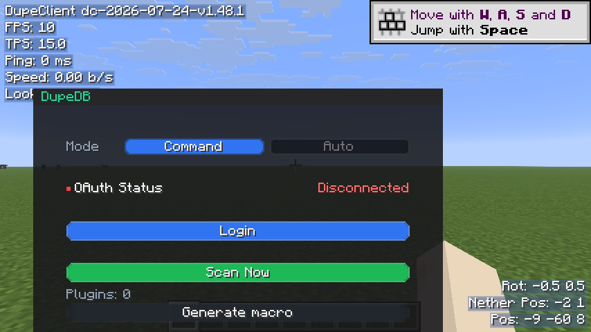

### P2W registry

```
/p2w mark
/p2w unmark
/p2w confirm mark|unmark
/p2w abort
```

### Packet Utils

Hub panel and overlays for the packet queue, fabricator, and sniffer. See [Packet Utils guide](docs/modules/packet-utils.md).


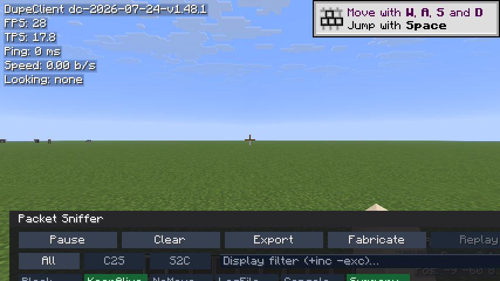

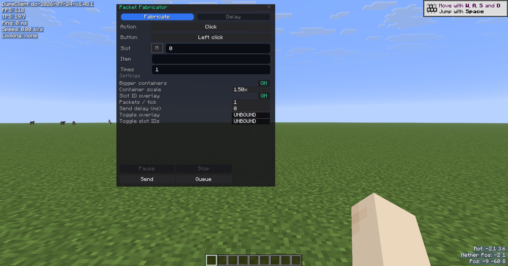

### PayAll

Bulk pay overlay. See [PayAll guide](docs/modules/payall.md).


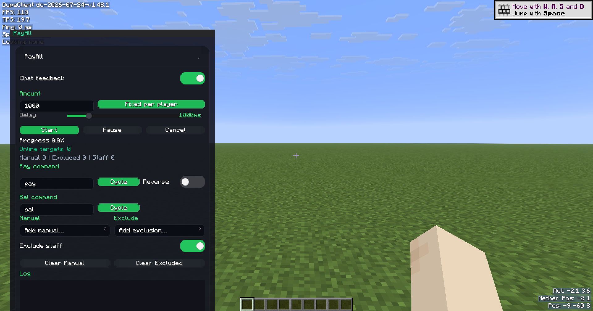

### MCPTools

Bot tools and bundle sync. See [MCPTools guide](docs/modules/mcptools.md).


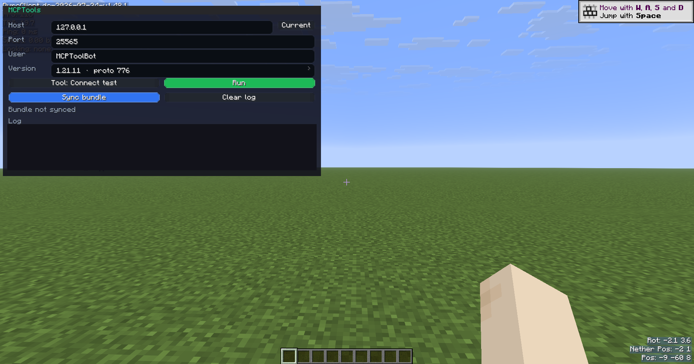

### Macros (under `/dupeclient`)

```
/dupeclient macro list
/dupeclient macro run <id>
/dupeclient macro stop
/dupeclient macro studio [id]
/dupeclient macro prompt [text]
/dupeclient macro export <id>
```


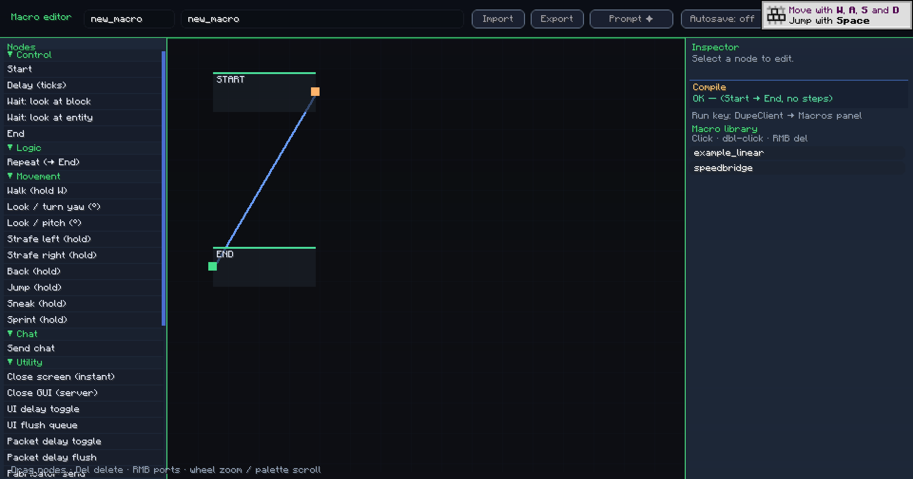

### HUD and vault

```
/hud editor | toggle | reset
/vault save | dismiss | lock
```


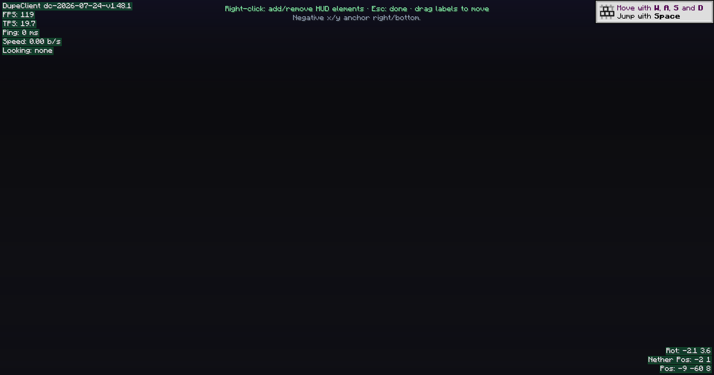

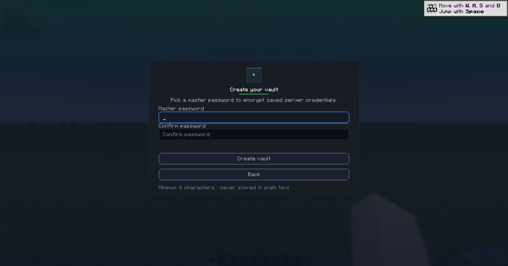

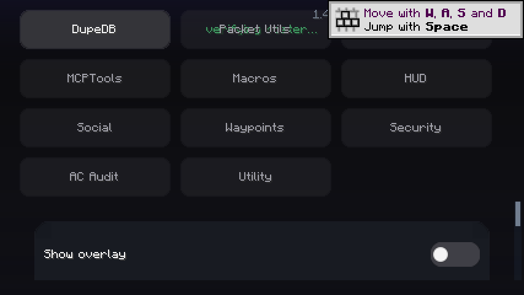

### Social

Friends list and presence. See [Social guide](docs/modules/social.md).


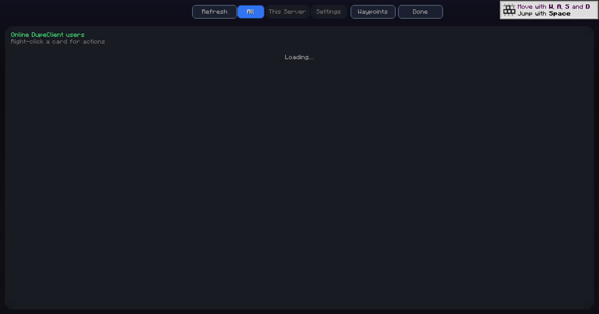

### Waypoints

Shared waypoints and Baritone pathing. See [Waypoints guide](docs/modules/waypoints.md).


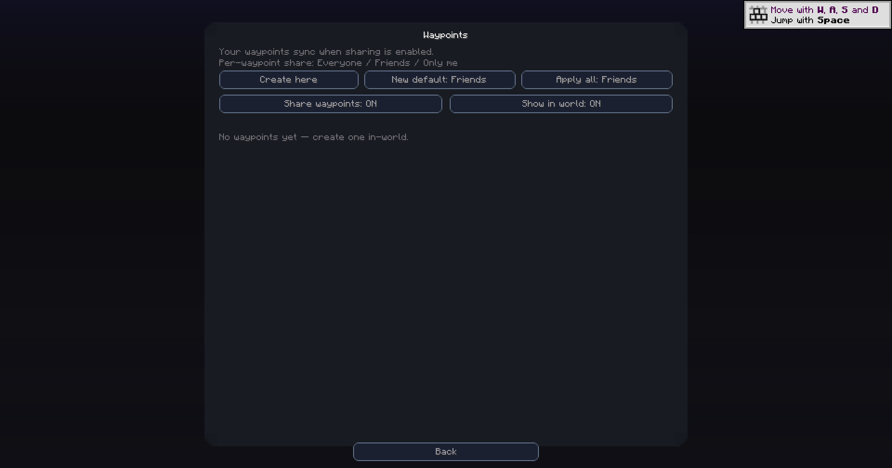

### AC Audit

Anticheat metrics overlay. See [AC Audit guide](docs/modules/ac-audit.md).


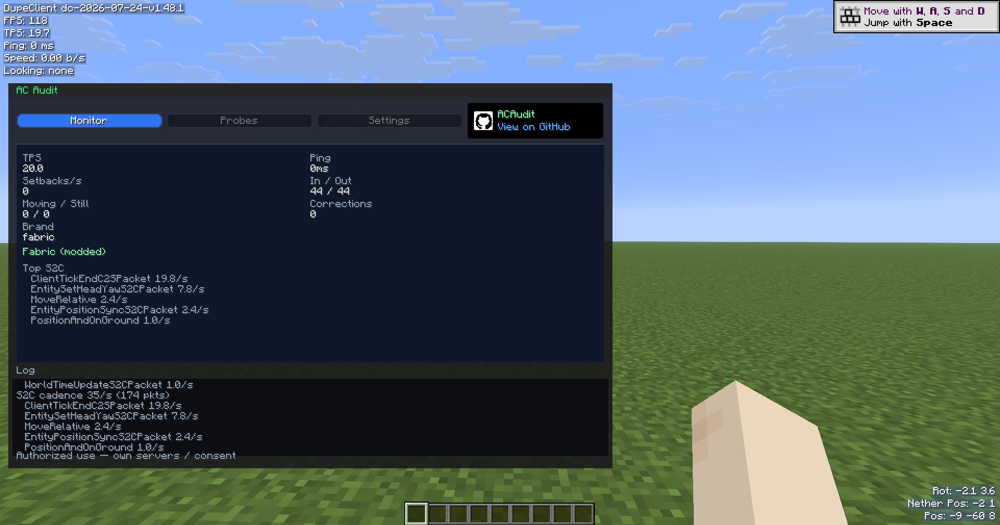

### Server helpers

```
/server plugins
/serversearch
```

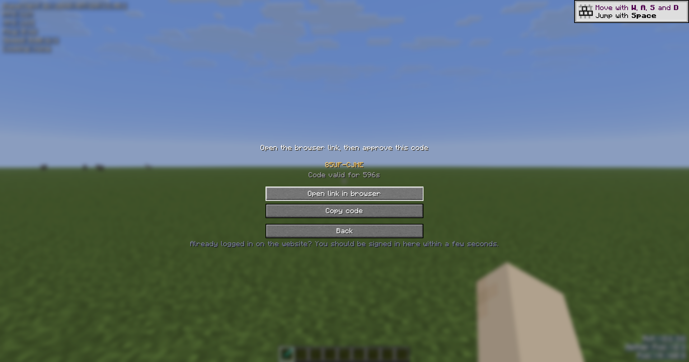

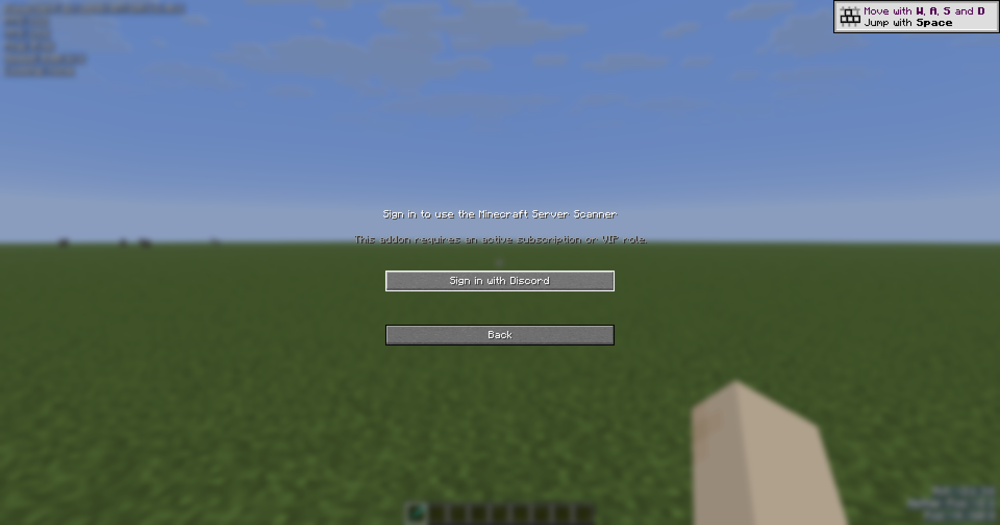

### Utility

```
/looknbt [print|chat]
/nbtedit
/dupe <item> [count]
```


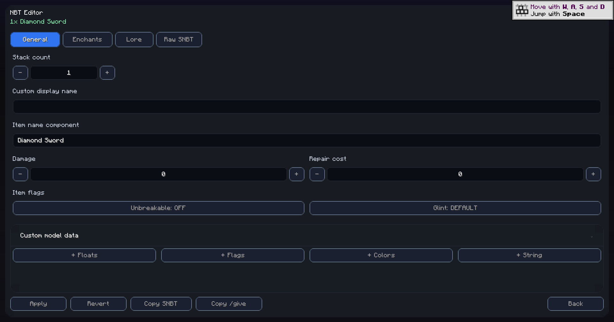

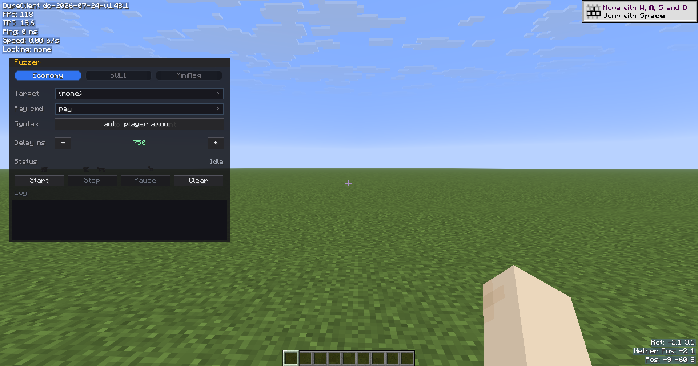

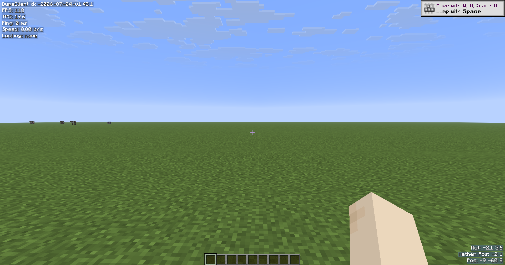

## Building

Clone the repository and use the Gradle wrapper (recommended).

### Default build (Minecraft 1.21.11)

```bash
./gradlew build
```

On Windows:

```bat
gradlew.bat build
```

Output: `build/libs/dupeclient-<mod_version>+1.21.11.jar` (remapped release jar).

### Other Minecraft versions

```bash
./gradlew build -PmcTarget=mc12110
./gradlew build -PmcTarget=mc12111
./gradlew build -PmcTarget=mc261
```

Or use convenience tasks: `build12110`, `build12111`, `build261`, `buildAllMcTargets`.

### Build options

| Property | Default | Description |
|----------|---------|-------------|
| `mcTarget` | `mc12111` | Minecraft profile |
| `skipVersionBump` | `true` | Keep `mod_version` unchanged on build |
| `autoVersionBump` | `false` | Bump version on build when enabled |
| `presenceApiBase` | production URL | Compile-time presence API base |

Copy `gradle.properties.example` to `gradle.properties.local` for local overrides (gitignored).

### CI and Pages

- **Build:** [`.github/workflows/build.yml`](.github/workflows/build.yml) runs on push and PR
- **Wiki:** [`.github/workflows/pages.yml`](.github/workflows/pages.yml) publishes `docs/` to GitHub Pages on push to `main`
- **Live wiki:** [https://theunsocialengineer.github.io/DupeClient/](https://theunsocialengineer.github.io/DupeClient/)

Pages uses the **GitHub Actions** source (Settings → Pages → Build and deployment → Source: GitHub Actions). The workflow runs automatically when `docs/**` changes on `main`.

### Presence API (private backend)

Social presence, P2W registry, waypoints, and MCPTools bundle sync are served by a separate backend:

- **Repo:** [TheUnsocialEngineer/REDACTED](https://github.com/TheUnsocialEngineer/REDACTED) (private)
- **Deploy:** Vercel — see [`REDACTED/README.md`](REDACTED/README.md)
- **Default client URL:** `https://eokascanner.xyz/api/client/presence` (override at build time with `-PpresenceApiBase=...`)

## Repository layout

```
DupeClient/
  docs/                  GitHub Pages wiki
  .github/workflows/     CI and Pages
  src/main/java/         Mod source
  src/main/resources/    fabric.mod.json, mixins, assets
  gradle/                Gradle wrapper
  build.gradle
  gradle.properties
  LICENSE
  README.md
```

## Development notes

- DupeDB Java API sources are unpacked at build time from JitPack.
- Yarn labels are generated during `processResources`.
- MixinSquared and SQLite are bundled.

Run a dev client with `./gradlew runClient`.

## License

MIT License. See [LICENSE](LICENSE).
